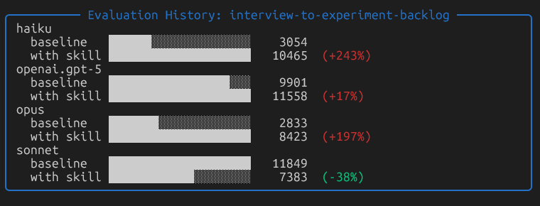

# interview-to-experiment-backlog-skill

Turn messy customer interview notes into a prioritized, testable experiment backlog.

## What it does

**Input:** Raw customer interview notes (unstructured, contradictory, incomplete)

**Output:** A ranked markdown table of 5–10 experiments, each with:
- A clear, falsifiable hypothesis
- Measurable success signal
- ICE score for prioritization

The skill extracts pain points, clusters related signals, and converts each problem into exactly one testable experiment.

## What it doesn't do

- Summarize interviews
- Brainstorm features
- Produce roadmaps
- Merge multiple problems into one experiment

## Usage

This skill is designed to be **model-agnostic** and can be used anywhere.
Copy the folder into your skills directory. The core instructions live in `SKILL.md`.

## Benchmark results

Evaluated using [Upskill](https://github.com/upskill):

### Accuracy (pass rate)

### Token usage (cost proxy)

- **Sonnet is the interesting one:** token usage *drops* while accuracy *improves* (!)
    - The skill makes Sonnet more direct and concise while still meeting the rubric.
    - The reduction in token usage suggests the skill constrains Sonnet’s tendency to over-elaborate, resulting in more direct and test-aligned outputs.

## Recommended models

**Recommended:** Sonnet (best accuracy + lowest cost)

## License

MIT
